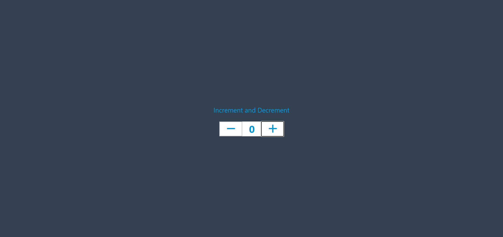

## 🔢 Counter App

A simple and interactive Counter Application built using HTML, CSS, and JavaScript. The app allows users to increase, decrease, and reset the counter value with a clean and responsive user interface.

### ✨ Features
- Increment Counter
- Decrement Counter
- Reset Counter
- Responsive Design
- User-Friendly Interface

### 🛠️ Technologies Used
- HTML5
- CSS3
- JavaScript

### 🎯 Purpose
This project was created to strengthen my understanding of JavaScript fundamentals, DOM manipulation, and event handling.
